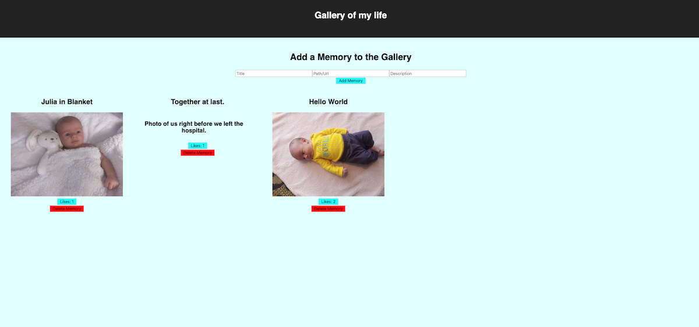

# React-Gallery

## Description
Duration: 15 hours

The React-Gallery is a web application that allows the user to keep store their favorite images. You can like, delete or add new images as well as clicking on them to view the description.

## Screen Shot
!

## Usage
1. Add and image to the gallery by filling out the form and clicking the "Add Memory" button.
2. Clicking on an image will reveal the description. Want to go back to the image, just click on the description.
3. Likes can be added by clicking on the "Likes" button. The button will also keep a count of all the 'likes'.
4. Have a bad memory? Feel free to click on the "Delete" button, but beware once deleted it will not be recovery.

## Built with
React, html, CSS, Node, Express, Javascript, PostgreSQL, Body-Parser

## Acknowledgement
Thanks to Prime Digital Academy in Kansas City who equipped and helped me to make this application a reality. Specifically Scott, Myron, and the Tyto cohort.

## Support
If you have suggestions or issues, please email me at allenlucke@gmail.com
